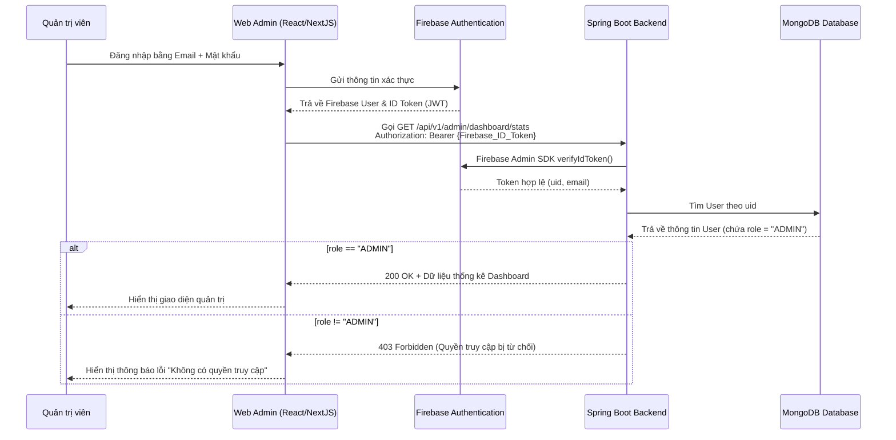

# TÀI LIỆU ĐẶC TẢ THIẾT KẾ TRANG ADMIN (ADMIN PORTAL DESIGN SPECIFICATION)

## HỆ THỐNG QUÉT VÀ QUẢN LÝ TÀI LIỆU DI ĐỘNG (SCANLINK)

**Phiên bản:** 1.0  
**Tác giả:** AI Assistant  
**Ngày khởi tạo:** 30/06/2026  
**Dựa trên tài liệu gốc:** BRD v4.0 & SDD v1.5 của ScanLink  

---

## 1. GIỚI THIỆU (INTRODUCTION)

### 1.1 Mục đích (Purpose)
Tài liệu này cung cấp thiết kế chi tiết cho **Trang Quản trị (Admin Portal)** thuộc hệ thống ScanLink. Mục tiêu của trang admin là giúp Quản trị viên (Admin) giám sát lưu lượng sử dụng hệ thống, thống kê các số liệu cốt lõi, quản lý trạng thái tài khoản người dùng, và điều chỉnh hạn mức lưu trữ (Quota) của từng cá nhân.

### 1.2 Đối tượng sử dụng
* **Quản trị viên (Admin):** Sử dụng giao diện web admin để thực hiện công việc vận hành hàng ngày.
* **Đội ngũ phát triển Backend:** Xây dựng các REST API bảo mật cho Admin trên nền tảng Spring Boot.
* **Đội ngũ phát triển Frontend:** Xây dựng giao diện Web (Dashboard, biểu đồ thống kê, bảng quản lý).

---

## 2. KIẾN TRÚC VÀ BẢO MẬT (ARCHITECTURE & SECURITY)

Trang Admin được xây dựng dưới dạng ứng dụng Web SPA (Single Page Application) tách biệt, giao tiếp với Spring Boot Backend thông qua các REST API được bảo mật.

### 2.1 Luồng Xác thực và Phân quyền (Authentication & Authorization Flow)

Trang Web Admin tái sử dụng **Firebase Authentication** làm giải pháp xác thực người dùng. Tuy nhiên, việc phân quyền truy cập (Authorization) sẽ dựa trên trường `role` được lưu trữ trong Database (MongoDB) của hệ thống.



### 2.2 Cấu hình Bảo mật Backend (Spring Security Configuration)
Các REST API dành riêng cho quản trị viên sẽ được đặt tiền tố `/api/v1/admin/**`. 
Spring Security Filter Chain sẽ được cấu hình như sau:

* Mọi request tới `/api/v1/admin/**` bắt buộc phải có Header `Authorization: Bearer {Token}` hợp lệ.
* Sau khi giải mã token bằng Firebase Admin SDK, Backend truy vấn cơ sở dữ liệu để kiểm tra quyền. Chỉ người dùng có `role == "ADMIN"` và `isActive == true` mới được đi qua Filter này. Nếu không, hệ thống trả về mã lỗi `403 Forbidden`.

---

## 3. THIẾT KẾ DỮ LIỆU BỔ SUNG (DATA DESIGN UPDATES)

Để hỗ trợ quản lý hạn mức dung lượng lưu trữ (Quota) cho người dùng, thực thể **USERS** (trong MongoDB) được bổ sung thêm trường `storage_limit`.

### Cập nhật Schema USERS:
```json
{
  "_id": "fb_uid_123456789",
  "email": "user@example.com",
  "display_name": "Nguyen Van A",
  "photo_url": "https://...",
  "role": "ADMIN", // Giá trị: "USER", "ADMIN"
  "is_active": true,
  "provider_id": "google.com",
  "storage_used": 154230, // Dung lượng đã dùng (Bytes)
  "storage_limit": 104857600, // Hạn mức dung lượng tối đa (Bytes) - Mặc định 100MB
  "created_at": "2026-06-24T15:52:44Z",
  "updated_at": "2026-06-24T15:52:44Z"
}
```

---

## 4. MÔ TẢ GIAO DIỆN VÀ CHỨC NĂNG (UI/UX & FUNCTIONAL SPECIFICATION)

Giao diện Web Admin bao gồm thanh menu điều hướng bên trái (Sidebar Navigation) và khu vực nội dung chính bên phải. Giao diện hỗ trợ giao diện tối/sáng (Dark/Light mode).

### 4.1 Màn hình Dashboard (Trang chủ Thống kê)

Trang chủ cung cấp cái nhìn tổng quan nhanh chóng về hoạt động của hệ thống thông qua các chỉ số Key Performance Indicators (KPIs) và biểu đồ trực quan hóa dữ liệu.

```
+-----------------------------------------------------------------------------------+
|  [ScanLink Admin]                                                      Dark/Light |
+-----------------------+-----------------------------------------------------------+
| (o) Dashboard         |   +--------------+ +--------------+ +-------------------+  |
|                       |   |  Total Users | |  Total Docs  | | Storage Used (GB) |  |
| [ ] User Management   |   |    1,245     | |    18,430    | |  45.8 GB / 500GB  |  |
|                       |   +--------------+ +--------------+ +-------------------+  |
| [ ] Doc Management    |                                                           |
|                       |   Biểu đồ 1: Số lượng tài liệu tải lên theo ngày (30 ngày)|
|                       |   [...................................................]   |
|                       |                                                           |
|                       |   Biểu đồ 2: Tỉ lệ đăng ký User mới (Google vs Email)     |
|                       |   [ (o) Google: 65%  ( ) Email/Pass: 35%              ]   |
+-----------------------+-----------------------------------------------------------+
```

#### Các thành phần chính:
1. **Các thẻ KPI (Summary Cards):**
   * **Total Users:** Tổng số tài khoản đăng ký trên hệ thống.
   * **Total Documents:** Tổng số lượng tài liệu đã tải lên Cloud.
   * **Total Storage Used:** Tổng dung lượng lưu trữ đang sử dụng thực tế trên S3 (tính bằng GB).
   * **Active Users (30 days):** Số lượng tài khoản có phát sinh ít nhất một request trong vòng 30 ngày qua.
2. **Biểu đồ hoạt động (Activity Charts):**
   * **Đăng ký mới (Line Chart):** Thống kê số lượng người dùng mới đăng ký theo ngày trong vòng 30 ngày gần nhất.
   * **Tải lên tài liệu (Bar Chart):** Thống kê số lượng file PDF/Ảnh được tải lên hệ thống hàng ngày.
3. **Danh sách Top Người dùng (Top Storage Users):**
   * Hiển thị danh sách 5 người dùng đang tiêu thụ tài nguyên lưu trữ nhiều nhất để hỗ trợ admin phát hiện tài khoản spam hoặc đề xuất nâng cấp hạn mức.

---

### 4.2 Màn hình Quản lý Người dùng (User Management)

Màn hình này cho phép Admin duyệt danh sách toàn bộ người dùng, tìm kiếm và thay đổi các cấu hình hệ thống liên quan tới tài khoản.

#### Các tính năng chính:
* **Bộ lọc và Tìm kiếm:** Tìm kiếm người dùng bằng cách nhập Email hoặc Tên hiển thị. Lọc theo trạng thái Hoạt động (Active / Inactive) hoặc Vai trò (User / Admin).
* **Danh sách Người dùng (Bảng):**
  * Cột thông tin: Ảnh đại diện, Tên hiển thị, Email, Trạng thái hoạt động, Phương thức đăng nhập, Dung lượng đã dùng / Giới hạn dung lượng, Ngày tạo.
* **Chi tiết Người dùng & Hành động:**
  * **Thay đổi trạng thái tài khoản (Kích hoạt / Khóa):** Một switch On/Off cho phép thay đổi nhanh giá trị `is_active` của người dùng. Khi bị khóa (`is_active = false`), mọi API của người dùng này gửi lên backend đều sẽ bị từ chối với mã lỗi `403 Forbidden` ngay tại lớp Security Filter.
  * **Thay đổi hạn mức lưu trữ (Quota Limit):** Nhập giá trị mới (tính bằng Megabytes hoặc Gigabytes) và lưu lại để cập nhật trường `storage_limit` của User.

---

### 4.3 Màn hình Quản lý Tài liệu (Document Management)

Màn hình này cho phép Admin quản lý các tài liệu lưu trữ trên hệ thống từ góc nhìn vĩ mô để đảm bảo nội dung tuân thủ quy định sử dụng dịch vụ.

#### Các tính năng chính:
* **Bộ lọc và Tìm kiếm:** Tìm kiếm tài liệu theo tiêu đề. Lọc tài liệu theo khoảng dung lượng tệp tin (File Size) hoặc tìm kiếm theo UID của chủ sở hữu.
* **Danh sách Tài liệu (Bảng):**
  * Cột thông tin: ID tài liệu, Tiêu đề, Email chủ sở hữu, Dung lượng file, Ngày tải lên, Số liên kết chia sẻ công khai đang tồn tại, Thao tác.
* **Hành động đặc quyền (Admin Override):**
  * **Xem nội dung trích xuất (OCR text):** Cho phép xem nhanh nội dung text mà ML Kit/OpenCV đã trích xuất từ tài liệu để kiểm tra nội dung.
  * **Xóa vĩnh viễn (Force Delete):** Nút xóa tài liệu. Khi nhấn, Backend sẽ nhận yêu cầu xóa vĩnh viễn tài liệu khỏi DB MongoDB đồng thời ra lệnh cho S3 File Storage xóa tệp tin vật lý để giải phóng tài nguyên hệ thống.

---

## 5. ĐẶC TẢ CHI TIẾT REST API CHO ADMIN (ADMIN RESTful API SPECIFICATION)

Tất cả các API này đều yêu cầu Header `Authorization: Bearer {Firebase_ID_Token}` có role tương ứng là `ADMIN`.

### 5.1 Nhóm API Thống kê (Dashboard & Analytics)

#### **[ADM-API-001] Lấy dữ liệu thống kê tổng hợp (KPIs)**
* **Mục đích:** Cung cấp các số liệu tóm tắt cho màn hình chính của Admin.
* **Phương thức & Đường dẫn:** `GET /api/v1/admin/dashboard/stats`
* **Đặc tả Đầu ra:**
  * **HTTP Status:** `200 OK`
  * **Response Body (JSON):**
    ```json
    {
      "status": "success",
      "message": "Lấy số liệu thống kê thành công",
      "data": {
        "totalUsers": 1245,
        "totalDocuments": 18430,
        "totalStorageUsedBytes": 49178230784,
        "activeUsers30Days": 856,
        "storageLimitMaxBytes": 536870912000
      }
    }
    ```

#### **[ADM-API-002] Lấy dữ liệu biểu đồ hoạt động**
* **Mục đích:** Lấy dữ liệu thống kê theo thời gian (đăng ký mới và upload file) để hiển thị biểu đồ.
* **Phương thức & Đường dẫn:** `GET /api/v1/admin/dashboard/charts`
* **Query Parameters:**
  * `days` (Integer, Tùy chọn, Mặc định = 30): Số ngày cần truy xuất dữ liệu ngược về quá khứ.
* **Đặc tả Đầu ra:**
  * **HTTP Status:** `200 OK`
  * **Response Body (JSON):**
    ```json
    {
      "status": "success",
      "message": "Lấy dữ liệu biểu đồ thành công",
      "data": {
        "registrationChart": [
          { "date": "2026-06-01", "count": 15 },
          { "date": "2026-06-02", "count": 22 }
        ],
        "uploadChart": [
          { "date": "2026-06-01", "count": 140 },
          { "date": "2026-06-02", "count": 185 }
        ],
        "providerDistribution": {
          "google.com": 810,
          "password": 435
        }
      }
    }
    ```

---

### 5.2 Nhóm API Quản lý Người dùng (User Administration)

#### **[ADM-API-003] Lấy danh sách người dùng**
* **Mục đích:** Trả về danh sách phân trang và lọc người dùng hệ thống.
* **Phương thức & Đường dẫn:** `GET /api/v1/admin/users`
* **Query Parameters:**
  * `page` (Integer, Tùy chọn, Mặc định = 0)
  * `size` (Integer, Tùy chọn, Mặc định = 20)
  * `search` (String, Tùy chọn): Tìm theo email hoặc displayName.
  * `isActive` (Boolean, Tùy chọn): Lọc theo trạng thái hoạt động.
* **Đặc tả Đầu ra:**
  * **HTTP Status:** `200 OK`
  * **Response Body (JSON):**
    ```json
    {
      "status": "success",
      "message": "Lấy danh sách người dùng thành công",
      "data": {
        "content": [
          {
            "uid": "fb_uid_123456789",
            "email": "user@example.com",
            "displayName": "Nguyen Van A",
            "photoUrl": "https://...",
            "role": "USER",
            "isActive": true,
            "storageUsed": 154230,
            "storageLimit": 104857600,
            "providerId": "google.com",
            "createdAt": "2026-06-24T15:52:44"
          }
        ],
        "pageable": { "pageNumber": 0, "pageSize": 20 },
        "totalElements": 1245,
        "totalPages": 63,
        "last": false
      }
    }
    ```

#### **[ADM-API-004] Cập nhật trạng thái hoạt động của User (Khóa/Mở tài khoản)**
* **Mục đích:** Cho phép khóa tài khoản vi phạm hoặc mở khóa tài khoản.
* **Phương thức & Đường dẫn:** `PUT /api/v1/admin/users/{uid}/status`
* **Request Body (JSON):**
  ```json
  {
    "isActive": false
  }
  ```
* **Đặc tả Đầu ra:**
  * **HTTP Status:** `200 OK`
  * **Response Body (JSON):**
    ```json
    {
      "status": "success",
      "message": "Trạng thái người dùng đã được cập nhật thành công",
      "data": {
        "uid": "fb_uid_123456789",
        "isActive": false,
        "updatedAt": "2026-06-30T18:00:00"
      }
    }
    ```

#### **[ADM-API-005] Thay đổi hạn mức lưu trữ (Quota Limit)**
* **Mục đích:** Tăng hoặc giảm giới hạn dung lượng lưu trữ tối đa được phép của một người dùng.
* **Phương thức & Đường dẫn:** `PUT /api/v1/admin/users/{uid}/quota`
* **Request Body (JSON):**
  ```json
  {
    "storageLimitBytes": 10737418240 // Ví dụ: đặt hạn mức mới là 10GB
  }
  ```
* **Đặc tả Đầu ra:**
  * **HTTP Status:** `200 OK`
  * **Response Body (JSON):**
    ```json
    {
      "status": "success",
      "message": "Hạn mức bộ nhớ đã được cập nhật thành công",
      "data": {
        "uid": "fb_uid_123456789",
        "storageLimit": 10737418240,
        "updatedAt": "2026-06-30T18:01:00"
      }
    }
    ```

---

### 5.3 Nhóm API Quản lý Tài liệu (Document Administration)

#### **[ADM-API-006] Lấy danh sách tài liệu hệ thống**
* **Mục đích:** Duyệt tìm tất cả tài liệu hiện có trong hệ thống từ tất cả người dùng.
* **Phương thức & Đường dẫn:** `GET /api/v1/admin/documents`
* **Query Parameters:**
  * `page` (Integer, Mặc định = 0)
  * `size` (Integer, Mặc định = 20)
  * `search` (String, Tùy chọn): Tìm theo tiêu đề tài liệu.
  * `ownerUid` (String, Tùy chọn): Lọc tài liệu theo chủ sở hữu cụ thể.
* **Đặc tả Đầu ra:**
  * **HTTP Status:** `200 OK`
  * **Response Body (JSON):**
    ```json
    {
      "status": "success",
      "message": "Lấy danh sách tài liệu thành công",
      "data": {
        "content": [
          {
            "id": "e2c34a8f-287d-41a4-94c6-e91040854d92",
            "title": "Hóa đơn mua hàng tháng 6",
            "ownerUid": "fb_uid_123456789",
            "ownerEmail": "user@example.com",
            "fileSize": 154230,
            "storageUrl": "https://s3.amazonaws.com/...",
            "createdAt": "2026-06-24T15:55:00"
          }
        ],
        "pageable": { "pageNumber": 0, "pageSize": 20 },
        "totalElements": 18430,
        "totalPages": 922,
        "last": false
      }
    }
    ```

#### **[ADM-API-007] Xóa tài liệu cưỡng chế (Admin Override)**
* **Mục đích:** Cho phép Admin trực tiếp xóa các tài liệu vi phạm bản quyền hoặc vi phạm quy chế. Tự động cập nhật dung lượng đã sử dụng (`storage_used`) của user và giải phóng tệp vật lý trên S3.
* **Phương thức & Đường dẫn:** `DELETE /api/v1/admin/documents/{id}`
* **Đặc tả Đầu ra:**
  * **HTTP Status:** `200 OK`
  * **Response Body (JSON):**
    ```json
    {
      "status": "success",
      "message": "Quản trị viên đã cưỡng chế xóa tài liệu thành công",
      "data": null
    }
    ```
* **Kịch bản ngoại lệ:**
  * `404 Not Found`: Không tìm thấy tài liệu theo ID cung cấp.

---

## 6. KẾ HOẠCH PHÁT TRIỂN TIẾP THEO (NEXT STEPS)

1. **Cấu hình Database MongoDB:** Viết các migration script để cập nhật thuộc tính `storage_limit` (mặc định ban đầu 100MB cho tất cả các bản ghi User hiện hữu).
2. **Cập nhật Logic Upload:** Trong Backend, tại hàm upload tài liệu (`[INT-API-003]`), cần bổ sung bước kiểm tra:
   * Nếu `storage_used + new_file_size > storage_limit` thì từ chối xử lý và trả về mã lỗi `400 Bad Request` (kèm thông báo "Dung lượng lưu trữ của bạn đã vượt quá hạn mức cho phép").
3. **Triển khai Web Frontend:** Lựa chọn framework React.js để dựng giao diện Web Admin tối giản, gọn nhẹ theo phong cách Clean & Modern, sử dụng Tailwind CSS cho tốc độ tùy biến nhanh.

---
**[KẾT THÚC BẢN ĐẶC TẢ THIẾT KẾ TRANG ADMIN V1.0]**
