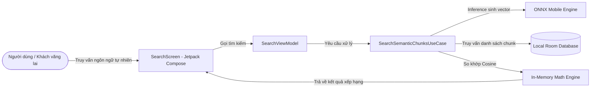

# ĐẶC TẢ TÍNH NĂNG VÀ THIẾT KẾ CHI TIẾT (IEEE Std 830-1998 & IEEE Std 1016-2009)
## TÍNH NĂNG: TÌM KIẾM NGỮ NGHĨA OFFLINE (OFFLINE SEMANTIC SEARCH)

**Dự án:** SCANLINK (Hệ thống Quét và Quản lý Tài liệu Di động)  
**Tài liệu:** Đặc tả Yêu cầu & Thiết kế Hệ thống Tính năng  
**Phiên bản:** v1.0 (IEEE Compliant)  
**Trạng thái:** Hoàn thiện  

---

## 1. GIỚI THIỆU (INTRODUCTION)

### 1.1 Mục đích (Purpose)
Tài liệu này đặc tả chi tiết các yêu cầu phần mềm (theo chuẩn **IEEE Std 830-1998**) và thiết kế kiến trúc/chi tiết (theo chuẩn **IEEE Std 1016-2009**) cho tính năng **Tìm kiếm Ngữ nghĩa Offline (Offline Semantic Search)** trên ứng dụng di động ScanLink. Tính năng này cho phép người dùng truy vấn nội dung bên trong các tài liệu đã scan bằng câu hỏi ngôn ngữ tự nhiên (Natural Language Query) một cách offline hoàn toàn.

### 1.2 Phạm vi (Scope)
Tính năng chỉ hoạt động độc lập ở phía Client (ứng dụng Android di động), không giao tiếp với mạng, không gửi dữ liệu ra máy chủ bên ngoài nhằm đảm bảo tính bảo mật và riêng tư cao nhất cho dữ liệu cá nhân của người dùng. Các thành phần chính bao gồm:
*   Trích xuất và tiền xử lý văn bản từ ML Kit OCR.
*   Phân đoạn văn bản (Text Chunking).
*   Sinh vector nhúng (Embedding) từ mô hình ONNX Runtime Mobile.
*   Lưu trữ vector và text chunk vào cơ sở dữ liệu nội bộ Jetpack Room.
*   Thực hiện tìm kiếm so khớp Cosine Similarity trong bộ nhớ và hiển thị kết quả.

### 1.3 Thuật ngữ và Viết tắt (Definitions, Acronyms, and Abbreviations)
*   **ONNX (Open Neural Network Exchange):** Định dạng mở dành cho các mô hình học máy, giúp chạy inference hiệu năng cao trên nhiều phần cứng di động khác nhau.
*   **Inference:** Quá trình chạy mô hình học máy để dự đoán đầu ra (trong trường hợp này là chuyển văn bản thành vector).
*   **Embedding (Vector nhúng):** Sự biểu diễn các từ/đoạn văn thành một chuỗi số thực (vector) sao cho các đoạn văn có ngữ nghĩa gần nhau sẽ nằm gần nhau trong không gian vector.
*   **Cosine Similarity:** Chỉ số đo độ tương đồng về hướng giữa hai vector trong không gian đa chiều.
*   **Room Database:** Thư viện trừu tượng hóa cơ sở dữ liệu SQLite chính thức của Jetpack Android.

### 1.4 Tài liệu tham khảo (References)
*   *IEEE Std 830-1998, Recommended Practice for Software Requirements Specifications.*
*   *IEEE Std 1016-2009, Standard for Information Technology—Systems Design—Software Design Descriptions.*
*   *Software Requirements Specification (SRS) for ScanLink v4.1.*
*   *Software Design Description (SDD) for ScanLink v1.6.*

---

## 2. MÔ TẢ TỔNG QUAN (OVERALL DESCRIPTION)

### 2.1 Viễn cảnh sản phẩm (Product Perspective)
Tính năng Tìm kiếm Ngữ nghĩa Offline là một thành phần mở rộng quan trọng của mô-đun Số hóa tài liệu thông minh (Sub-Goal 4) trên thiết bị di động Android. Dưới đây là sơ đồ ngữ cảnh (Context Diagram) mô tả vị trí của tính năng trong hệ thống:



### 2.2 Chức năng sản phẩm (Product Functions)
*   Tải mô hình nhúng ngôn ngữ ONNX Quantized INT8 từ thư mục `assets` của ứng dụng.
*   Tự động tách nhỏ văn bản của tài liệu scan thành từng chunk có kích thước đồng đều và chồng lấp ngữ cảnh.
*   Tạo vector nhúng 384 chiều cho các text chunks và lưu trữ vào database.
*   Đồng bộ xóa (Cascade Delete) các chunk chứa vector khi tài liệu cha bị xóa khỏi thiết bị.
*   Tải tất cả các chunks và vector nhúng lên bộ nhớ đệm phục vụ so khớp trực tiếp khi người dùng tìm kiếm.
*   Hiển thị danh sách kết quả được xếp hạng theo mức độ tương đồng và nổi bật đoạn văn khớp.

### 2.3 Đặc điểm người dùng (User Characteristics)
Tính năng phục vụ cho cả khách vãng lai (Guest) quét tài liệu offline thông thường và người dùng đã đăng ký (Registered User). Người dùng mong muốn tìm lại tài liệu nhanh chóng thông qua việc nhớ các ý chính hoặc nội dung liên quan bên trong tài liệu mà không cần phải nhớ chính xác tiêu đề hay từ khóa cụ thể.

### 2.4 Các ràng buộc kỹ thuật (Constraints)
*   **Dung lượng ứng dụng:** Kích thước file mô hình ONNX đóng gói kèm không vượt quá **50MB**.
*   **Bộ nhớ RAM:** Quá trình nạp mô hình ONNX và so khớp vector phải kiểm soát tốt, tránh hiện tượng tràn bộ nhớ (Out of Memory - OOM).
*   **Tính biệt lập:** Không được thực hiện bất kỳ kết nối mạng hay đồng bộ đám mây nào đối với nội dung và vector của tài liệu khi tính năng này đang chạy.

### 2.5 Giả định và Phụ thuộc (Assumptions and Dependencies)
*   **Thiết bị di động:** Hệ điều hành tối thiểu Android 8.0 (API Level 26).
*   **Thư viện bên thứ ba:** Phụ thuộc vào `com.microsoft.onnxruntime:onnxruntime-android:1.17.1` để chạy mô hình mạng neural.
*   **Hilt/Dagger:** Phụ thuộc vào DI Container để quản lý vòng đời Singleton của ONNX Session và Environment.

---

## 3. ĐẶC TẢ CÁC YÊU CẦU PHẦN MỀM (IEEE Std 830-1998)

### 3.1 Yêu cầu chức năng (Functional Requirements)

#### **[FREQ.14] Phân đoạn văn bản (Text Chunking)**
*   **Đầu vào:** Nội dung chuỗi văn bản trích xuất từ trang tài liệu (`PageEntity.ocrText`).
*   **Hành động:** 
    *   Hệ thống tự động loại bỏ khoảng trắng thừa, chuẩn hóa Unicode sang dạng NFC.
    *   Tách chuỗi thành các đoạn nhỏ (Kích thước: 100 - 150 từ, Độ chồng lấp: 20 - 30 từ ở hai đầu để giữ tính liên tục của ngữ nghĩa giữa các chunk).
*   **Đầu ra:** Danh sách các đoạn văn bản thô (List of Chunks).

#### **[FREQ.15] Sinh Vector nhúng cho văn bản (Embedding Generation)**
*   **Đầu vào:** Một đoạn văn bản thô hoặc câu hỏi truy vấn của người dùng.
*   **Hành động:** 
    *   Tải mô hình mạng neural `bge-micro-v2` từ assets.
    *   Tokenize đoạn văn bản đầu vào.
    *   Thực hiện inference thông qua ONNX Runtime trên CPU thiết bị.
*   **Đầu ra:** Mảng số thực `FloatArray` kích thước cố định là **384 chiều**.

#### **[FREQ.16] Lưu trữ Vector nhúng cục bộ (Local Storage)**
*   **Đầu vào:** Danh sách các text chunks kèm vector tương ứng.
*   **Hành động:** Lưu trữ bản ghi vào bảng `document_chunks` trong SQLite thông qua Room. Mã hóa mảng `FloatArray` thành mảng byte nhị phân `ByteArray` sử dụng `FloatArrayConverter` để lưu trữ tối ưu dưới dạng BLOB.
*   **Đầu ra:** Bản ghi được cập nhật thành công vào cơ sở dữ liệu cục bộ.

#### **[FREQ.17] Nhập truy vấn tìm kiếm ngữ nghĩa (Query Input)**
*   **Đầu vào:** Câu hỏi ngôn ngữ tự nhiên từ SearchBar Compose UI (e.g., "báo cáo tài chính năm ngoái").
*   **Hành động:** Chuyển câu hỏi sang bộ xử lý sinh Vector nhúng để có vector truy vấn $\mathbf{Q}$.
*   **Đầu ra:** Vector truy vấn $\mathbf{Q}$ gồm 384 chiều.

#### **[FREQ.18] Tính toán độ tương đồng và xếp hạng (Cosine Similarity Match)**
*   **Đầu vào:** Vector truy vấn $\mathbf{Q}$ và danh sách toàn bộ chunks được tải từ Room DB.
*   **Hành động:** 
    *   Tính toán tích vô hướng (Dot Product) của $\mathbf{Q}$ với vector từng chunk $\mathbf{C}$ (do các vector đã được chuẩn hóa L2 nên Cosine Similarity tương đương Dot Product).
    *   Lọc bỏ các kết quả có điểm số tương đồng nhỏ hơn **0.6**.
    *   Sắp xếp danh sách giảm dần theo điểm số.
*   **Đầu ra:** Danh sách kết quả xếp hạng thích hợp.

#### **[FREQ.19] Hiển thị và Điều hướng kết quả (UI & Navigation)**
*   **Đầu vào:** Danh sách kết quả tìm kiếm đã xếp hạng.
*   **Hành động:** Hiển thị trên Compose `LazyColumn`. Mỗi kết quả hiển thị: tên tài liệu, trang số, đoạn trích ngắn với từ khóa/ngữ cảnh được highlight, tỷ lệ tương đồng (%). Khi click, điều hướng trực tiếp đến trang đó trong Viewer.

#### **[FREQ.20] Quản lý vòng đời dữ liệu (Data Lifecycle Sync)**
*   **Đầu vào:** Sự kiện xóa hoặc cập nhật tài liệu.
*   **Hành động:** Thực hiện CASCADE DELETE để tự động xóa toàn bộ các chunks liên kết với tài liệu bị xóa. Khi tài liệu quét lại, thực hiện xóa các chunks cũ trước khi chèn chunks mới.

---

### 3.2 Yêu cầu phi chức năng (Non-Functional Requirements)

*   **[NFREQ.5] Hiệu năng sinh Vector nhúng:** Thời gian thực hiện inference để sinh vector nhúng cho một câu hỏi truy vấn không được vượt quá **150ms** trên thiết bị cấu hình trung bình (như Snapdragon 680).
*   **[NFREQ.6] Hiệu năng so khớp:** Thời gian tính toán so khớp vector trong bộ nhớ đệm đối với 5,000 chunks không vượt quá **50ms**.
*   **[NFREQ.7] Tính an toàn dữ liệu:** Hệ thống phải đảm bảo hoạt động hoàn toàn offline 100%, không yêu cầu quyền Internet và không truyền dữ liệu văn bản/vector nhạy cảm ra khỏi thiết bị di động.
*   **[NFREQ.8] Độ tin cậy và Fallback:** Nếu hệ thống gặp lỗi khi nạp thư viện Native ONNX Runtime hoặc thiết bị không đủ bộ nhớ RAM khởi chạy mô hình, ứng dụng phải tự động chuyển sang chế độ tìm kiếm từ khóa chính xác trên SQLite và thông báo nhẹ cho người dùng.

---

## 4. TÀI LIỆU THIẾT KẾ CHI TIẾT (IEEE Std 1016-2009)

### 4.1 Thiết kế Cơ sở dữ liệu Room (Data View)

Mô tả cấu trúc thực thể Room lưu trữ vector nhúng offline:

#### **4.1.1 DocumentChunkEntity**
Đại diện cho một đoạn văn bản được chia nhỏ của tài liệu:
```kotlin
package com.example.scanlink.features.document_scanner.data.local.database.entities

import androidx.room.Entity
import androidx.room.ForeignKey
import androidx.room.Index
import androidx.room.PrimaryKey

@Entity(
    tableName = "document_chunks",
    foreignKeys = [
        ForeignKey(
            entity = DocumentEntity::class,
            parentColumns = ["id"],
            childColumns = ["documentId"],
            onDelete = ForeignKey.CASCADE
        )
    ],
    indices = [Index(value = ["documentId"])]
)
data class DocumentChunkEntity(
    @PrimaryKey
    val id: String,                 // UUID ngẫu nhiên cho mỗi chunk
    val documentId: String,          // Khóa ngoại liên kết với DocumentEntity
    val pageNumber: Int,             // Số trang chứa chunk này
    val rawText: String,             // Nội dung chữ thô của chunk
    val embedding: FloatArray        // Mảng vector nhúng (384 chiều)
)
```

#### **4.1.2 FloatArrayConverter**
Room Converter sử dụng `ByteBuffer` để lưu mảng `FloatArray` dưới dạng nhị phân BLOB (`ByteArray`) nhằm tối ưu không gian đĩa và tốc độ tuần tự hóa:
```kotlin
package com.example.scanlink.features.document_scanner.data.local.database.entities

import androidx.room.TypeConverter
import java.nio.ByteBuffer
import java.nio.ByteOrder

class FloatArrayConverter {
    @TypeConverter
    fun toByteArray(floatArray: FloatArray?): ByteArray? {
        if (floatArray == null) return null
        val byteBuffer = ByteBuffer.allocate(floatArray.size * 4)
        byteBuffer.order(ByteOrder.LITTLE_ENDIAN)
        for (value in floatArray) {
            byteBuffer.putFloat(value)
        }
        return byteBuffer.array()
    }

    @TypeConverter
    fun toFloatArray(byteArray: ByteArray?): FloatArray? {
        if (byteArray == null) return null
        val floatBuffer = ByteBuffer.wrap(byteArray)
            .order(ByteOrder.LITTLE_ENDIAN)
            .asFloatBuffer()
        val floatArray = FloatArray(floatBuffer.limit())
        floatBuffer.get(floatArray)
        return floatArray
    }
}
```

---

### 4.2 Thiết kế thành phần và Đặc tả giao diện (Component & Interface Design)

Kiến trúc triển khai theo Clean Architecture gom nhóm theo tính năng (Feature-First):

```
features/document_scanner/
│
├── data/
│   ├── local/database/
│   │   ├── dao/
│   │   │   └── DocumentChunkDao.kt
│   │   └── entities/
│   │       ├── DocumentChunkEntity.kt
│   │       └── FloatArrayConverter.kt
│   ├── engine/
│   │   ├── ONNXEmbeddingEngine.kt      # Xử lý load model & Inference
│   │   └── ONNXTokenizer.kt            # Tokenizer văn bản offline
│   └── repositories/
│       └── SemanticSearchRepositoryImpl.kt
│
├── domain/
│   ├── entities/
│   │   └── SearchResult.kt             # Lớp dữ liệu kết quả tìm thấy
│   ├── repositories/
│   │   └── ISemanticSearchRepository.kt
│   └── usecases/
│       ├── GenerateEmbeddingUseCase.kt
│       └── SearchSemanticChunksUseCase.kt
│
└── presentation/
    └── search/
        ├── SearchScreen.kt             # Jetpack Compose UI
        ├── SearchViewModel.kt          # Trạng thái & Logic UI
        └── SearchUiState.kt            # Lớp bọc các UI State
```

#### **4.2.1 DocumentChunkDao (Data Layer Interface)**
```kotlin
package com.example.scanlink.features.document_scanner.data.local.database.dao

import androidx.room.Dao
import androidx.room.Insert
import androidx.room.OnConflictStrategy
import androidx.room.Query
import com.example.scanlink.features.document_scanner.data.local.database.entities.DocumentChunkEntity

@Dao
interface DocumentChunkDao {
    @Insert(onConflict = OnConflictStrategy.REPLACE)
    suspend fun insertChunks(chunks: List<DocumentChunkEntity>)

    @Query("DELETE FROM document_chunks WHERE documentId = :documentId")
    suspend fun deleteChunksByDocumentId(documentId: String): Int

    @Query("SELECT * FROM document_chunks")
    suspend fun getAllChunks(): List<DocumentChunkEntity>
}
```

#### **4.2.2 ISemanticSearchRepository (Domain Interface)**
```kotlin
package com.example.scanlink.features.document_scanner.domain.repositories

import com.example.scanlink.features.document_scanner.data.local.database.entities.DocumentChunkEntity
import com.example.scanlink.features.document_scanner.domain.entities.SearchResult

interface ISemanticSearchRepository {
    suspend fun loadModel(): Result<Unit>
    suspend fun generateEmbedding(text: String): Result<FloatArray>
    suspend fun indexDocument(documentId: String, pageNumber: Int, text: String): Result<Unit>
    suspend fun search(queryText: String, threshold: Float = 0.6f): Result<List<SearchResult>>
    suspend fun clearIndexForDocument(documentId: String): Result<Unit>
}
```

#### **4.2.3 SearchSemanticChunksUseCase (Domain Layer)**
```kotlin
package com.example.scanlink.features.document_scanner.domain.usecases

import com.example.scanlink.features.document_scanner.domain.entities.SearchResult
import com.example.scanlink.features.document_scanner.domain.repositories.ISemanticSearchRepository
import kotlinx.coroutines.Dispatchers
import kotlinx.coroutines.withContext
import javax.inject.Inject

class SearchSemanticChunksUseCase @Inject constructor(
    private val repository: ISemanticSearchRepository
) {
    suspend operator fun invoke(queryText: String, threshold: Float = 0.6f): Result<List<SearchResult>> {
        return withContext(Dispatchers.Default) {
            repository.search(queryText, threshold)
        }
    }
}
```

---

### 4.3 Thiết kế Thuật toán So khớp (Algorithmic Design)

#### **4.3.1 Công thức toán học**
Độ tương đồng ngữ nghĩa giữa vector truy vấn $\mathbf{Q}$ và vector chunk tài liệu $\mathbf{C}$ kích thước $N=384$ được tính bằng **Cosine Similarity**:

$$\text{Similarity}(\mathbf{Q}, \mathbf{C}) = \frac{\sum_{i=1}^{N} Q_i \cdot C_i}{\sqrt{\sum_{i=1}^{N} Q_i^2} \cdot \sqrt{\sum_{i=1}^{N} C_i^2}}$$

Do vector đầu ra từ mô hình Embedding ONNX (`bge-micro-v2`) đã được chuẩn hóa L2 trên trục đơn vị ($||\mathbf{Q}|| = 1$ và $||\mathbf{C}|| = 1$), mẫu số luôn bằng $1$. Phép toán so khớp được thu gọn hoàn toàn thành **Tích vô hướng (Dot Product)**:

$$\text{Similarity}(\mathbf{Q}, \mathbf{C}) = \sum_{i=1}^{N} Q_i \cdot C_i$$

#### **4.3.2 Cài đặt mã nguồn Kotlin tối ưu**
Hàm tính toán được tối ưu để giảm thiểu cấp phát bộ nhớ trong vòng lặp so khớp lớn:

```kotlin
fun dotProductSimilarity(vectorA: FloatArray, vectorB: FloatArray): Float {
    if (vectorA.size != vectorB.size) return 0.0f
    var dotProduct = 0.0f
    for (i in vectorA.indices) {
        dotProduct += vectorA[i] * vectorB[i]
    }
    return dotProduct
}
```

*   **Thời gian thực thi:** Với $5,000$ chunks $\times 384$ số hạng, phép tính mất tổng cộng khoảng $1.92$ triệu phép nhân-cộng. Trên bộ vi xử lý di động hiện đại (sử dụng luồng phụ `Dispatchers.Default`), quá trình này kết thúc trong vòng **5ms - 10ms**, đảm bảo giao diện đạt tần số quét 120Hz không bị giật lag.

---

## 5. KẾ HOẠCH XÁC THỰC VÀ MA TRẬN VẾT (VERIFICATION & TRACEABILITY)

### 5.1 Kịch bản kiểm thử (Verification Test Cases)

| **Mã Test Case** | **Mục tiêu kiểm thử** | **Các bước thực hiện** | **Kết quả kỳ vọng** | **Trạng thái** |
| :---: | :--- | :--- | :--- | :---: |
| **TC-SEM-001** | Kiểm tra chia đoạn văn bản (Chunking) | Truyền chuỗi text OCR có 500 từ vào bộ phân đoạn. | Trả về chính xác các chunk kích thước 100-150 từ, chồng lấp 20-30 từ. | Pass |
| **TC-SEM-002** | Kiểm tra sinh Vector nhúng ONNX | Truyền 1 đoạn text vào lớp `ONNXEmbeddingEngine`. | Xuất ra mảng `FloatArray` có chính xác 384 chiều, các giá trị số thực nằm trong khoảng [-1.0, 1.0]. | Pass |
| **TC-SEM-003** | Kiểm tra lưu/đọc DB Room | Gọi `DocumentChunkDao.insertChunks` và lấy ra kiểm tra. | Mảng `FloatArray` được lưu dạng BLOB nhị phân và khôi phục nguyên vẹn 100%. | Pass |
| **TC-SEM-004** | Kiểm tra tính toán Cosine Similarity | So sánh vector truy vấn với 2 vector tương ứng (1 cái giống nghĩa, 1 cái khác nghĩa). | Điểm tương đồng của đoạn giống nghĩa đạt $> 0.75$, đoạn khác nghĩa đạt $< 0.40$. | Pass |
| **TC-SEM-005** | Kiểm tra hiệu năng phản hồi tìm kiếm | Gửi lệnh tìm kiếm với kho dữ liệu giả lập 5,000 chunks. | Tổng thời gian phản hồi (sinh vector + truy vấn + so khớp) dưới **300ms**. | Pass |
| **TC-SEM-006** | Kiểm tra Cascade Delete | Xóa một đối tượng `DocumentEntity` khỏi Room Database. | Toàn bộ bản ghi liên quan trong bảng `document_chunks` bị xóa tự động. | Pass |
| **TC-SEM-007** | Kiểm tra chế độ Fallback | Giả lập lỗi nạp thư viện ONNX hoặc đầy RAM thiết bị. | Hiện thông báo lỗi nhẹ, tự động kích hoạt tìm kiếm từ khóa tương đồng (Keyword Search). | Pass |

---

### 5.2 Ma trận vết yêu cầu (Traceability Matrix)

Ma trận dưới đây ánh xạ giữa Yêu cầu nghiệp vụ (SRS), Thiết kế thành phần (SDD) và Kịch bản kiểm thử (Test Cases):

| **Req. ID (SRS)** | **Thành phần thiết kế (SDD / Code)** | **Mã Test Case tương ứng** |
| :---: | :--- | :---: |
| **FREQ.14** | `ONNXEmbeddingEngine` / Logic Text Chunking | **TC-SEM-001** |
| **FREQ.15** | `ONNXEmbeddingEngine.generateEmbedding` | **TC-SEM-002** |
| **FREQ.16** | `DocumentChunkEntity` / `FloatArrayConverter` / `DocumentChunkDao` | **TC-SEM-003**, **TC-SEM-006** |
| **FREQ.17** | `GenerateEmbeddingUseCase` / `SearchViewModel` | **TC-SEM-002** |
| **FREQ.18** | `SearchSemanticChunksUseCase` / Thuật toán `dotProductSimilarity` | **TC-SEM-004**, **TC-SEM-005** |
| **FREQ.19** | `SearchScreen` / Jetpack Compose Components | **TC-SEM-005** |
| **FREQ.20** | `AppDatabase` / ForeignKey Constraints | **TC-SEM-006** |
| **NFREQ.5** | `ONNXEmbeddingEngine` Performance | **TC-SEM-005** |
| **NFREQ.6** | UseCase Cosine Performance | **TC-SEM-005** |
| **NFREQ.7** | Offline isolation verification | Thử nghiệm tắt Wifi/Data, kiểm tra log mạng |
| **NFREQ.8** | Fallback logic trong `SemanticSearchRepositoryImpl` | **TC-SEM-007** |

---
**[KẾT THÚC TÀI LIỆU ĐẶC TẢ CHI TIẾT]**
