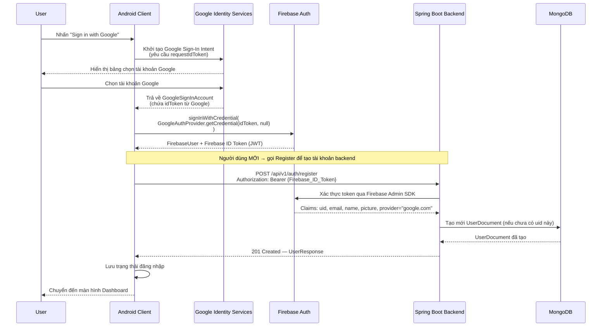
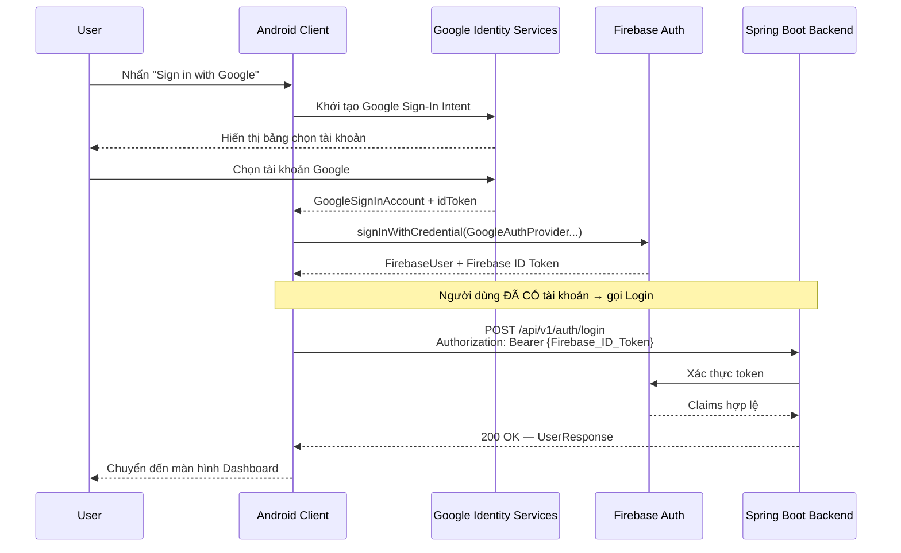

# ĐẶC TẢ TÍNH NĂNG: ĐĂNG NHẬP BẰNG GOOGLE ACCOUNT

**Tài liệu:** Feature Specification — Google Sign-In  
**Dự án:** ScanLink  
**Phiên bản:** 1.0  
**Ngày:** 24/06/2026  
**Liên quan đến SDD:** Mục 5.3.1 ([INT-API-001], [INT-API-002]), mục 5.1  

---

## 1. TỔNG QUAN (Overview)

### 1.1 Mô tả tính năng

Tính năng **Google Sign-In** cho phép người dùng đăng nhập vào ScanLink bằng tài khoản Google của họ thay vì phải nhập email/password thủ công. Toàn bộ quá trình xác thực danh tính được ủy quyền cho **Firebase Authentication với Google Provider**, sau đó backend nhận được Firebase ID Token hợp lệ để đồng bộ thông tin người dùng.

### 1.2 Phạm vi (Scope)

| Thành phần | Thay đổi |
|---|---|
| Android Client | Thêm Google Sign-In button + luồng OAuth |
| Firebase Console | Kích hoạt Google Auth Provider |
| Spring Boot Backend | **Không thay đổi API** — cùng endpoint `/auth/login` và `/auth/register`, chỉ cần xử lý thêm `photo_url` và `provider_id = "google.com"` |
| MongoDB | Thêm trường `providerId` vào User Document |

### 1.3 Điểm khác biệt so với Email/Password

| | Email/Password | Google Sign-In |
|---|---|---|
| Nhập liệu | Email + Password | Chọn tài khoản Google |
| Firebase step 1 | `createUserWithEmailAndPassword` / `signInWithEmailAndPassword` | `signInWithCredential(GoogleAuthProvider.getCredential(...))` |
| Backend API | Giống nhau — `POST /api/v1/auth/register` và `POST /api/v1/auth/login` | Giống nhau |
| `photoUrl` | Thường null (người dùng chưa đặt ảnh) | Tự động lấy từ Google Profile |
| `providerId` | `"password"` | `"google.com"` |

---

## 2. LUỒNG XỬ LÝ (Flow)

### 2.1 Luồng đăng nhập Google lần đầu (Lần đầu dùng app — Chưa có tài khoản)



### 2.2 Luồng đăng nhập Google lần kế tiếp (Tài khoản đã tồn tại)



### 2.3 Quyết định Register hay Login

Client không thể biết trước liệu người dùng đã có tài khoản backend hay chưa khi dùng Google Sign-In lần đầu. Chiến lược xử lý:

```
Firebase signInWithCredential() thành công
         ↓
Gọi POST /api/v1/auth/login
         ↓
    ┌── 200 OK ──────────────────────────────→ Đăng nhập thành công ✅
    │
    └── 404 Not Found (chưa sync backend)
             ↓
        Gọi POST /api/v1/auth/register
             ↓
        201 Created → Đăng nhập thành công ✅
```

> **Lưu ý:** Backend phải đảm bảo `/auth/register` là **idempotent** — nếu `uid` đã tồn tại thì trả về `200 OK` với thông tin hiện có, không tạo trùng.

---

## 3. THIẾT KẾ ANDROID (Android Implementation Design)

### 3.1 Dependencies cần thêm (build.gradle.kts)

```kotlin
// Google Sign-In
implementation("com.google.android.gms:play-services-auth:21.2.0")

// Credential Manager API (Android 14+, thay thế cho GoogleSignInClient truyền thống)
implementation("androidx.credentials:credentials:1.3.0")
implementation("androidx.credentials:credentials-play-services-auth:1.3.0")
implementation("com.google.android.libraries.identity.googleid:googleid:1.1.1")
```

### 3.2 Cấu trúc file mới trong Feature Authentication

```
features/authentication/
├── data/
│   ├── datasources/remote/
│   │   └── (không cần thêm — dùng chung IAuthApiService)
│   └── repositories/
│       └── AuthenticationRepositoryImpl.kt   ← thêm signInWithGoogle()
│
├── domain/
│   ├── repositories/
│   │   └── IAuthenticationRepository.kt      ← thêm signInWithGoogle()
│   └── usecases/
│       └── SignInWithGoogleUseCase.kt         ← [MỚI]
│
└── presentation/
    ├── login/
    │   ├── LoginContent.kt                    ← thêm Google Sign-In Button
    │   ├── LoginEvent.kt                      ← thêm GoogleSignInResult event
    │   ├── LoginState.kt                      ← (không đổi)
    │   └── LoginViewModel.kt                  ← thêm handleGoogleSignIn()
    └── component/
        └── GoogleSignInButton.kt              ← [MỚI] — UI component
```

### 3.3 Interface Repository — method mới

```kotlin
interface IAuthenticationRepository {
    // ... các method hiện có ...

    /**
     * Đăng nhập bằng Google ID Token (từ Google Identity Services).
     * Tự động thực hiện:
     *   1. signInWithCredential(GoogleAuthProvider) lên Firebase
     *   2. Lấy Firebase ID Token
     *   3. Gọi POST /auth/login; nếu 404 → gọi POST /auth/register
     *
     * @param googleIdToken  idToken nhận được từ GoogleSignInAccount
     * @return Result<UserEntity> — thành công hoặc exception
     */
    suspend fun signInWithGoogle(googleIdToken: String): Result<UserEntity>
}
```

### 3.4 Repository Implementation — signInWithGoogle()

```kotlin
override suspend fun signInWithGoogle(googleIdToken: String): Result<UserEntity> = runCatching {
    // Bước 1: Xác thực với Firebase bằng Google credential
    val credential = GoogleAuthProvider.getCredential(googleIdToken, null)
    val authResult = firebaseAuth.signInWithCredential(credential).await()
    val firebaseUser = authResult.user ?: throw Exception("Google Sign-In Firebase thất bại")

    // Bước 2: Lấy Firebase ID Token mới nhất
    val idToken = firebaseUser.getIdToken(true).await().token
        ?: throw Exception("Lỗi không lấy được Token xác thực")

    val bearerToken = "Bearer $idToken"

    // Bước 3: Thử Login trước
    val loginResponse = authApiService.loginWithEmail(authorization = bearerToken)

    if (loginResponse.isSuccessful) {
        // Tài khoản đã tồn tại → trả về thông tin user
        return@runCatching loginResponse.body()?.data?.toUserEntity()
            ?: throw InvalidServerResponseException()
    }

    if (loginResponse.code() == 404) {
        // Chưa có tài khoản backend → tự động đăng ký
        val registerResponse = authApiService.registerWithEmailAndPassword(
            authorization = bearerToken
        )
        if (!registerResponse.isSuccessful) throw mapHttpError(registerResponse)
        return@runCatching registerResponse.body()?.data?.toUserEntity()
            ?: throw InvalidServerResponseException()
    }

    // Các lỗi khác (401, 500...)
    throw mapHttpError(loginResponse)
}
```

### 3.5 UseCase mới

```kotlin
class SignInWithGoogleUseCase @Inject constructor(
    private val repository: IAuthenticationRepository
) {
    suspend operator fun invoke(googleIdToken: String): Result<UserEntity> {
        return repository.signInWithGoogle(googleIdToken)
    }
}
```

### 3.6 ViewModel — xử lý Google Sign-In

```kotlin
// LoginEvent.kt — thêm event mới
sealed class LoginEvent {
    data class EmailChanged(val value: String) : LoginEvent()
    data class PasswordChanged(val value: String) : LoginEvent()
    object Submit : LoginEvent()
    data class GoogleSignInResult(val idToken: String) : LoginEvent()  // ← MỚI
    object GoogleSignInFailed : LoginEvent()                            // ← MỚI
}

// LoginViewModel.kt — thêm handler
fun onEvent(event: LoginEvent) {
    when (event) {
        // ... các case hiện có ...
        is LoginEvent.GoogleSignInResult -> handleGoogleSignIn(event.idToken)
        LoginEvent.GoogleSignInFailed -> _state.update {
            it.copy(errorResId = R.string.error_google_sign_in_cancelled)
        }
    }
}

private fun handleGoogleSignIn(googleIdToken: String) {
    viewModelScope.launch {
        _state.update { it.copy(isLoading = true, errorResId = null) }

        val result = signInWithGoogleUseCase(googleIdToken)

        result.fold(
            onSuccess = { entity ->
                _state.update { it.copy(isLoading = false, successUser = entity) }
            },
            onFailure = { err ->
                err.printStackTrace()
                _state.update {
                    it.copy(isLoading = false, errorResId = err.toUserFriendlyErrorResId())
                }
            }
        )
    }
}
```

### 3.7 UI — GoogleSignInButton

```kotlin
@Composable
fun GoogleSignInButton(
    onClick: () -> Unit,
    modifier: Modifier = Modifier,
    isLoading: Boolean = false
) {
    OutlinedButton(
        onClick = onClick,
        modifier = modifier.fillMaxWidth().height(56.dp),
        shape = MaterialTheme.shapes.medium,
        enabled = !isLoading
    ) {
        Image(
            painter = painterResource(R.drawable.ic_google_logo),
            contentDescription = null,
            modifier = Modifier.size(20.dp)
        )
        Spacer(Modifier.width(12.dp))
        Text("Continue with Google", fontSize = 15.sp)
    }
}
```

---

## 4. THIẾT KẾ BACKEND (Backend Implementation Design)

### 4.1 Tổng quan — KHÔNG cần API mới

Backend **không cần tạo endpoint mới**. Cả hai endpoint hiện có đều xử lý được Google Sign-In:

| Endpoint | Dùng cho |
|---|---|
| `POST /api/v1/auth/register` | Google Sign-In lần đầu (auto-register) |
| `POST /api/v1/auth/login` | Google Sign-In từ lần 2 trở đi |

Lý do: Firebase Admin SDK đã trích xuất đầy đủ thông tin từ token, kể cả provider là `google.com` hay `password`.

### 4.2 Thông tin Firebase Admin SDK trích xuất được

Khi backend gọi `firebaseAuth.verifyIdToken(idToken)`, `FirebaseToken` chứa:

```java
String uid        = decodedToken.getUid();          // Firebase UID (duy nhất)
String email      = decodedToken.getEmail();         // Email đã xác thực của Google
String name       = (String) decodedToken.getClaims().get("name");         // Tên Google
String picture    = (String) decodedToken.getClaims().get("picture");      // Avatar Google
String providerId = (String) decodedToken.getClaims().get("firebase")
                    .get("sign_in_provider");        // "google.com" hoặc "password"
boolean verified  = decodedToken.isEmailVerified();  // Luôn true với Google
```

### 4.3 Thay đổi trong `UserEntity` (MongoDB Document)

Thêm trường `providerId` để phân biệt phương thức đăng nhập:

```java
@Document(collection = "users")
public class UserEntity {
    @Id
    private String uid;
    private String email;
    private String displayName;
    private String photoUrl;
    private String role;
    private boolean isActive;
    private String dateOfBirth;
    private String gender;
    private String providerId;      // ← THÊM MỚI: "password" | "google.com"
    private long storageUsed;
    private LocalDateTime createdAt;
    private LocalDateTime updatedAt;
}
```

### 4.4 Logic trong `AuthService.syncUser()` (cho endpoint `/auth/register`)

```java
public UserResponse syncUser(FirebaseToken decodedToken) {
    String uid        = decodedToken.getUid();
    String email      = decodedToken.getEmail();
    String name       = (String) decodedToken.getClaims().get("name");
    String picture    = (String) decodedToken.getClaims().get("picture");
    String provider   = extractProvider(decodedToken); // "google.com" hoặc "password"

    return userRepository.findByUid(uid)
        .map(existing -> {
            // Tài khoản đã tồn tại → cập nhật thông tin mới nhất từ Google
            existing.setDisplayName(name != null ? name : existing.getDisplayName());
            existing.setPhotoUrl(picture != null ? picture : existing.getPhotoUrl());
            existing.setUpdatedAt(LocalDateTime.now());
            return userRepository.save(existing);
        })
        .orElseGet(() -> {
            // Tài khoản chưa tồn tại → tạo mới
            UserEntity newUser = new UserEntity();
            newUser.setUid(uid);
            newUser.setEmail(email);
            newUser.setDisplayName(name != null ? name : email.split("@")[0]);
            newUser.setPhotoUrl(picture);
            newUser.setRole("USER");
            newUser.setActive(true);
            newUser.setProviderId(provider);
            newUser.setStorageUsed(0L);
            newUser.setCreatedAt(LocalDateTime.now());
            newUser.setUpdatedAt(LocalDateTime.now());
            return userRepository.save(newUser);
        });
}

private String extractProvider(FirebaseToken token) {
    try {
        Map<?, ?> firebase = (Map<?, ?>) token.getClaims().get("firebase");
        return (String) firebase.get("sign_in_provider");
    } catch (Exception e) {
        return "unknown";
    }
}
```

### 4.5 Logic trong `AuthService.loginUser()` (cho endpoint `/auth/login`)

```java
public UserResponse loginUser(FirebaseToken decodedToken) {
    String uid = decodedToken.getUid();

    UserEntity user = userRepository.findByUid(uid)
        .orElseThrow(() -> new ResourceNotFoundException("Tài khoản không tồn tại"));

    if (!user.isActive()) {
        throw new ForbiddenException("Tài khoản đã bị vô hiệu hóa");
    }

    // Cập nhật photoUrl mới nhất từ Google (có thể thay đổi)
    String latestPicture = (String) decodedToken.getClaims().get("picture");
    if (latestPicture != null && !latestPicture.equals(user.getPhotoUrl())) {
        user.setPhotoUrl(latestPicture);
        user.setUpdatedAt(LocalDateTime.now());
        userRepository.save(user);
    }

    return UserResponse.from(user);
}
```

### 4.6 `UserResponse` DTO — trả về thêm `providerId`

```java
public class UserResponse {
    private String uid;
    private String email;
    private String displayName;
    private String photoUrl;        // Quan trọng với Google Sign-In
    private String role;
    private boolean isActive;
    private String dateOfBirth;
    private String gender;
    private String providerId;      // ← THÊM MỚI
    private LocalDateTime createdAt;
    private LocalDateTime updatedAt;
}
```

---

## 5. HỢP ĐỒNG API (API Contract)

> Không thay đổi endpoint. Chỉ bổ sung trường `providerId` trong response.

### 5.1 `POST /api/v1/auth/register` — Google Sign-In lần đầu

**Request:**
```
POST /api/v1/auth/register
Authorization: Bearer {Firebase_ID_Token_of_Google_User}
Content-Type: application/json
Body: (trống)
```

**Response 201 Created:**
```json
{
  "status": "success",
  "message": "Sync thành công",
  "data": {
    "uid": "google_firebase_uid_abc123",
    "email": "user@gmail.com",
    "displayName": "Nguyen Van A",
    "photoUrl": "https://lh3.googleusercontent.com/a/ACg8ocKxxx",
    "role": "USER",
    "isActive": true,
    "dateOfBirth": null,
    "gender": null,
    "providerId": "google.com",
    "createdAt": "2026-06-24T15:52:44",
    "updatedAt": "2026-06-24T15:52:44"
  }
}
```

**Response 200 OK** (nếu uid đã tồn tại — idempotent):
```json
{
  "status": "success",
  "message": "Tài khoản đã tồn tại, cập nhật thành công",
  "data": { ... }
}
```

### 5.2 `POST /api/v1/auth/login` — Google Sign-In từ lần 2

**Request:**
```
POST /api/v1/auth/login
Authorization: Bearer {Firebase_ID_Token_of_Google_User}
```

**Response 200 OK:**
```json
{
  "status": "success",
  "message": "Đăng nhập thành công",
  "data": {
    "uid": "google_firebase_uid_abc123",
    "email": "user@gmail.com",
    "displayName": "Nguyen Van A",
    "photoUrl": "https://lh3.googleusercontent.com/a/ACg8ocKxxx",
    "role": "USER",
    "isActive": true,
    "dateOfBirth": null,
    "gender": null,
    "providerId": "google.com",
    "createdAt": "2026-06-24T15:52:44",
    "updatedAt": "2026-06-24T15:52:44"
  }
}
```

**Response 404 Not Found** (chưa đồng bộ):
```json
{
  "status": "error",
  "message": "Tài khoản không tồn tại",
  "data": null
}
```

---

## 6. XỬ LÝ LỖI (Error Handling)

### 6.1 Mapping lỗi Google Sign-In phía Client

| Exception | Nguyên nhân | Hiển thị cho User |
|---|---|---|
| `GetCredentialCancellationException` | User đóng bảng chọn tài khoản | (ẩn — không hiện gì) |
| `GetCredentialException` | Thiết bị không hỗ trợ hoặc Play Services lỗi | `error_google_sign_in_unavailable` |
| `FirebaseAuthUserCollisionException` | Email của Google đã đăng ký với Email/Password | `error_email_collision_google` |
| `AccountNotSyncedException` (404) | Backend không tìm thấy UID → tự động register | (ẩn — xử lý nội bộ) |
| `BackendUnauthorizedException` (401) | Token hết hạn | `error_token_expired` |
| `ServerErrorException` (500) | Lỗi server | `error_server` |
| `IOException` / `SocketTimeoutException` | Mất kết nối | `error_no_network` / `error_network_timeout` |

### 6.2 String Resources cần thêm

**`values/strings.xml` (EN):**
```xml
<string name="error_google_sign_in_cancelled">Sign-in cancelled</string>
<string name="error_google_sign_in_unavailable">Google Sign-In is unavailable on this device</string>
<string name="error_email_collision_google">This email is already registered with a password. Please sign in with email instead</string>
```

**`values-vi/strings.xml` (VI):**
```xml
<string name="error_google_sign_in_cancelled">Đã hủy đăng nhập</string>
<string name="error_google_sign_in_unavailable">Google Sign-In không khả dụng trên thiết bị này</string>
<string name="error_email_collision_google">Email này đã được đăng ký bằng mật khẩu. Vui lòng đăng nhập bằng email thay thế</string>
```

---

## 7. CẤU HÌNH (Configuration)

### 7.1 Firebase Console

1. Vào **Firebase Console → Authentication → Sign-in method**
2. Bật **Google provider**
3. Chọn **Project support email**
4. Lưu lại **Web client ID** (dùng cho Android `requestIdToken`)

### 7.2 Android `google-services.json`

File `google-services.json` tự động chứa `client_id` sau khi kích hoạt Google provider. Android Client dùng:

```kotlin
val gso = GoogleSignInOptions.Builder(GoogleSignInOptions.DEFAULT_SIGN_IN)
    .requestIdToken(getString(R.string.default_web_client_id))  // ← từ google-services.json
    .requestEmail()
    .build()
```

### 7.3 SHA-1 Certificate Fingerprint

> **Bắt buộc** — Google Sign-In sẽ không hoạt động nếu thiếu bước này.

```bash
# Debug keystore
./gradlew signingReport

# Thêm SHA-1 vào Firebase Console → Project Settings → Android App
```

### 7.4 Spring Boot — Không cần cấu hình thêm

Firebase Admin SDK đã được cấu hình sẵn (tham chiếu `config/FirebaseConfig.java`). Google ID Token sau khi qua Firebase `signInWithCredential()` đã trở thành Firebase ID Token chuẩn — backend xử lý giống hệt Email/Password flow.

---

## 8. CHECKLIST TRIỂN KHAI (Implementation Checklist)

### 8.1 Backend Team ✅

- [ ] Thêm trường `providerId` (String) vào `UserEntity.java`
- [ ] Thêm trường `providerId` vào `UserResponse.java`
- [ ] Cập nhật `AuthService.syncUser()`: trích xuất `sign_in_provider` từ Firebase token claims
- [ ] Cập nhật `AuthService.syncUser()`: đảm bảo **idempotent** — uid đã tồn tại → `200 OK` (update), chưa tồn tại → `201 Created`
- [ ] Cập nhật `AuthService.loginUser()`: tự động sync `photoUrl` mới nhất từ Google token claims
- [ ] Kiểm tra không tạo trùng tài khoản khi cùng email đăng ký bằng 2 provider khác nhau (email collision policy)
- [ ] Viết unit test cho `AuthService.syncUser()` với mock Google token

### 8.2 Android Team ✅

- [ ] Thêm dependencies `play-services-auth` + `credentials` vào `build.gradle.kts`
- [ ] Thêm SHA-1 fingerprint vào Firebase Console
- [ ] Kích hoạt Google Provider trên Firebase Console
- [ ] Tạo `SignInWithGoogleUseCase.kt`
- [ ] Cập nhật `IAuthenticationRepository.kt` — thêm `signInWithGoogle()`
- [ ] Cập nhật `AuthenticationRepositoryImpl.kt` — implement `signInWithGoogle()`
- [ ] Cập nhật `LoginEvent.kt` — thêm `GoogleSignInResult` và `GoogleSignInFailed`
- [ ] Cập nhật `LoginViewModel.kt` — thêm `handleGoogleSignIn()`
- [ ] Tạo `GoogleSignInButton.kt` component
- [ ] Cập nhật `LoginContent.kt` — thêm nút + divider
- [ ] Thêm string resources mới (EN + VI)
- [ ] Thêm icon Google (`ic_google_logo.xml`) vào drawable
- [ ] Cập nhật Hilt DI module — inject `SignInWithGoogleUseCase`

---

## 9. PHỤ LỤC — Firebase Token Claims (Google)

Khi decode Firebase ID Token của người dùng đăng nhập bằng Google, `FirebaseToken.getClaims()` trả về:

```json
{
  "iss": "https://securetoken.google.com/{project-id}",
  "aud": "{project-id}",
  "auth_time": 1719244364,
  "user_id": "abc123xyz",
  "sub": "abc123xyz",
  "iat": 1719244364,
  "exp": 1719247964,
  "email": "user@gmail.com",
  "email_verified": true,
  "name": "Nguyen Van A",
  "picture": "https://lh3.googleusercontent.com/a/ACg8ocKxxx",
  "firebase": {
    "identities": {
      "google.com": ["123456789012345678901"],
      "email": ["user@gmail.com"]
    },
    "sign_in_provider": "google.com"
  }
}
```

**Các trường cần thiết cho Backend:**

| Firebase Claim | Java Code | Dùng để |
|---|---|---|
| `sub` / `user_id` | `token.getUid()` | Khóa chính MongoDB |
| `email` | `token.getEmail()` | Lưu email |
| `name` | `claims.get("name")` | Display name |
| `picture` | `claims.get("picture")` | Photo URL |
| `email_verified` | `token.isEmailVerified()` | Luôn true với Google |
| `firebase.sign_in_provider` | `((Map) claims.get("firebase")).get("sign_in_provider")` | `"google.com"` |

---

*[KẾT THÚC TÀI LIỆU ĐẶC TẢ TÍNH NĂNG GOOGLE SIGN-IN]*
