# Software Design Specification

## Authentication and Navigation Module

# 1. Overview

Module Authentication and Navigation chịu trách nhiệm:

* Quản lý vòng đời truy cập của người dùng.
* Xác định người dùng đã đăng nhập hay chưa.
* Điều hướng đến màn hình phù hợp.
* Bảo vệ các màn hình yêu cầu xác thực.
* Quản lý Session trong toàn bộ ứng dụng.

Kiến trúc được xây dựng theo:

* Single Activity Architecture.
* Jetpack Compose Navigation.
* MVVM.
* Clean Architecture.
* Unidirectional Data Flow.

---

# 2. System Architecture

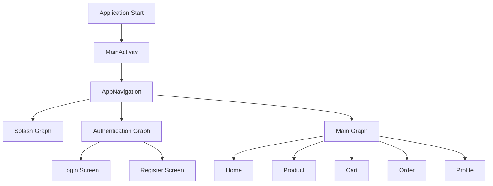

MainActivity là Activity duy nhất của ứng dụng.

---

# 3. Startup Flow

Khi ứng dụng khởi động:

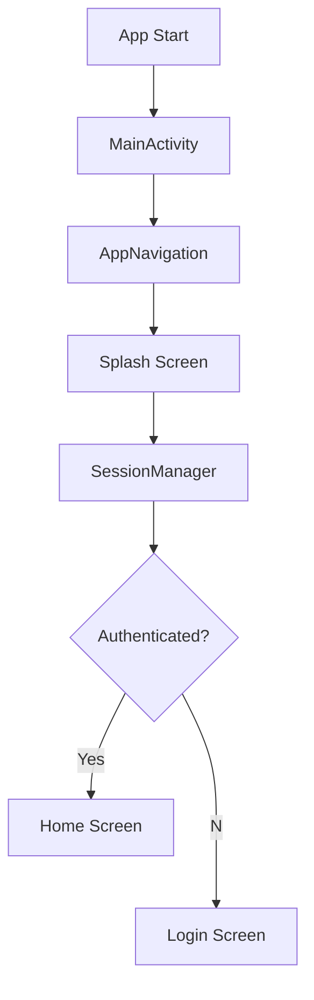

Splash Screen chỉ có nhiệm vụ xác định trạng thái xác thực.

---

# 4. Authentication Flow

## Login Flow

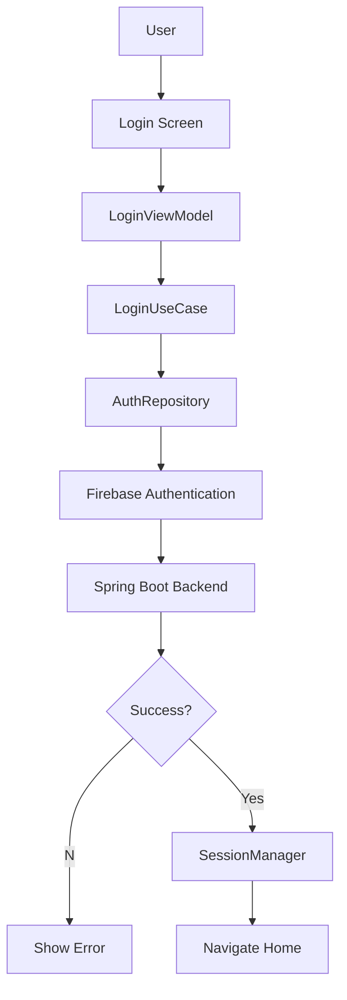

---

## Register Flow

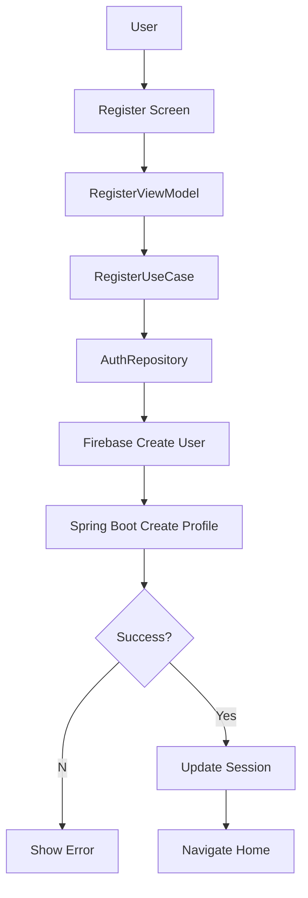

Có thể thay Navigate Home bằng Navigate Login tùy nghiệp vụ.

---

# 5. Session Management

SessionManager là thành phần trung tâm quản lý trạng thái đăng nhập.

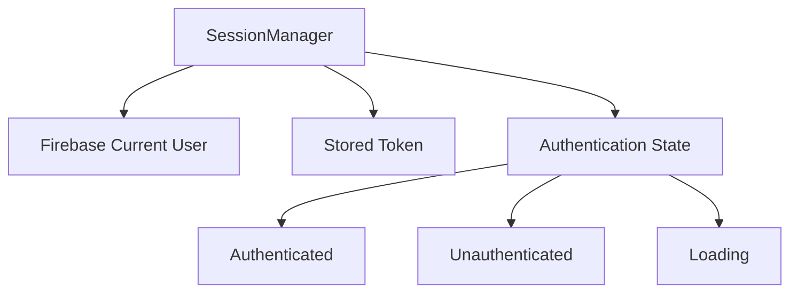

Responsibilities:

* Kiểm tra Session.
* Quản lý Token.
* Logout.
* Cập nhật Authentication State.

---

# 6. Navigation Graph

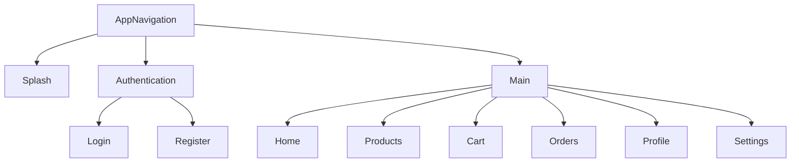

---

# 7. Login Navigation

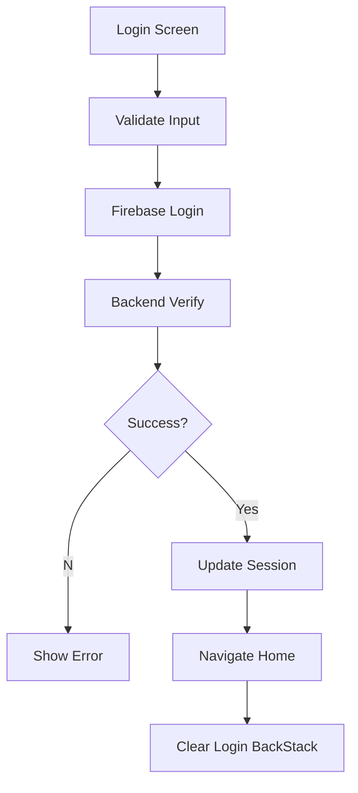

---

# 8. Register Navigation

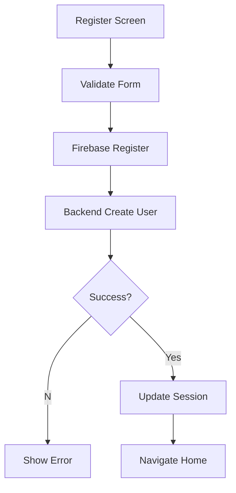

---

# 9. Logout Flow

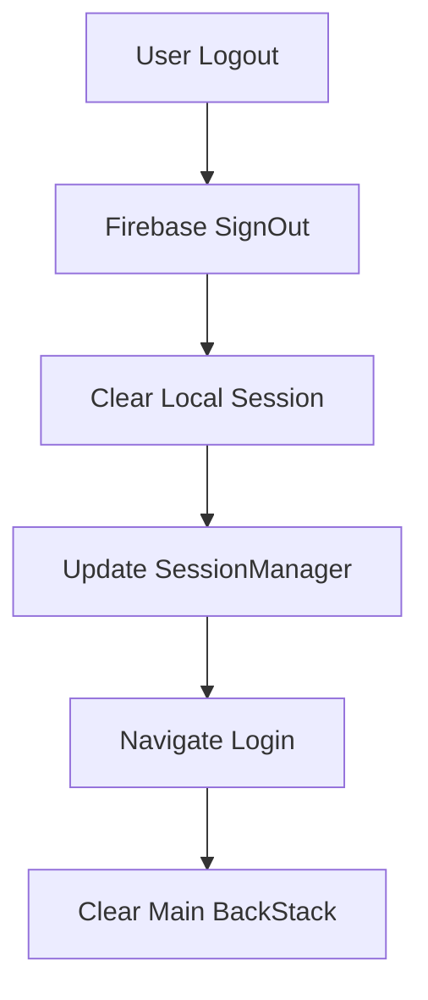

---

# 10. MVVM Interaction

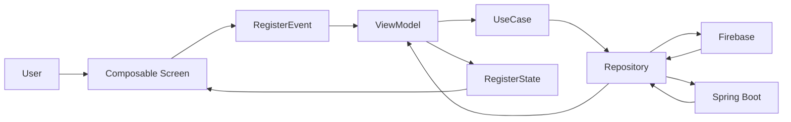

UI chỉ gửi Event và render State.

---

# 11. Clean Architecture Layers

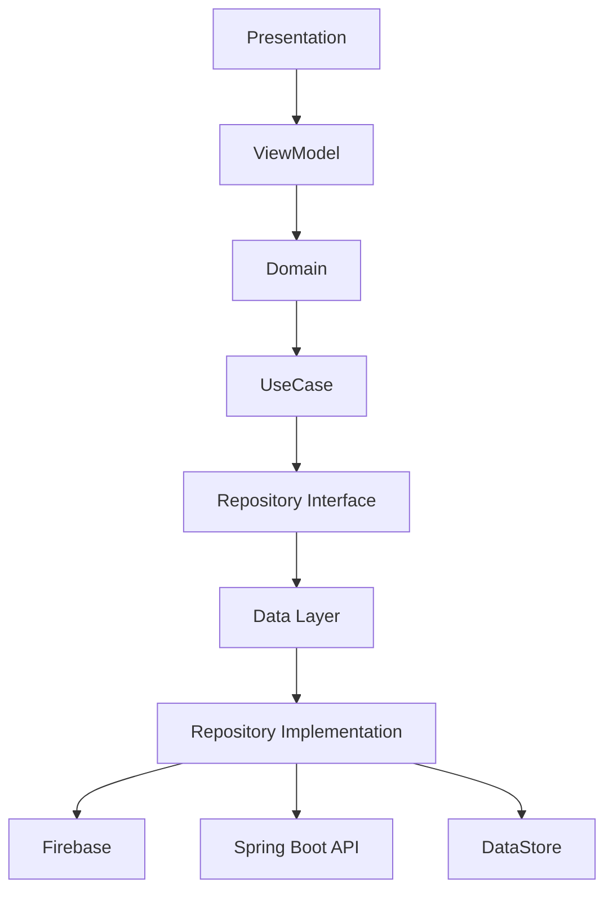

Dependency chỉ đi từ ngoài vào trong.

---

# 12. Screen Responsibilities

## Splash

* Kiểm tra Session.
* Điều hướng ban đầu.

## Login

* Đăng nhập.
* Điều hướng sang Register.
* Điều hướng sang Home.

## Register

* Tạo tài khoản.
* Đồng bộ Backend.
* Điều hướng sau đăng ký.

## Home

* Màn hình chính.
* Điều hướng đến các tính năng khác.

---

# 13. Navigation Rules

Rule 1:
Người dùng chưa xác thực chỉ được truy cập Authentication Graph.

Rule 2:
Người dùng đã xác thực không quay lại Login hoặc Register bằng nút Back.

Rule 3:
Logout phải xóa toàn bộ Main Graph khỏi Back Stack.

Rule 4:
Splash chỉ xuất hiện khi khởi động ứng dụng.

---

# 14. Package Structure

```text
app/

├── MainActivity
│
├── navigation/
│   ├── AppNavigation
│   ├── AuthGraph
│   ├── MainGraph
│   └── Routes
│
├── features/
│
│   ├── splash/
│   ├── authentication/
│   │      ├── login/
│   │      └── register/
│   │
│   ├── home/
│   ├── profile/
│   ├── product/
│   ├── cart/
│   └── order/
│
├── domain/
│
├── data/
│
└── core/
```

---

# 15. Advantages

* Single Activity Architecture.
* Compose Navigation.
* MVVM.
* Clean Architecture.
* Low Coupling.
* High Cohesion.
* Scalable.
* Testable.
* Production Ready.
* Dễ mở rộng Google Login, Facebook Login, OTP và các role khác trong tương lai.
